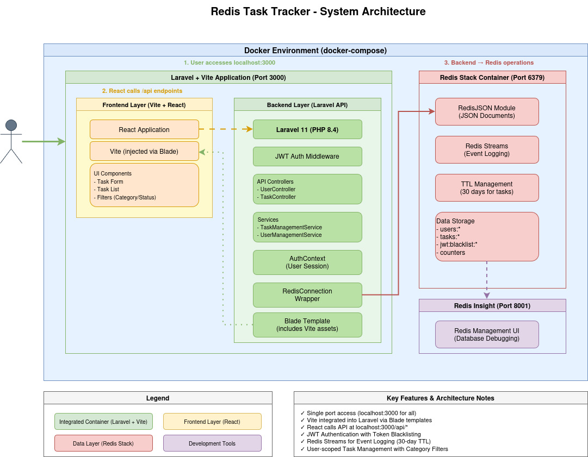

# Redis Task Tracker

A full-stack task management application built with Laravel 12 (PHP 8.4) and Redis as the primary database. Features JWT authentication, real-time task management, and audit logging using Redis Streams.

## Tech Stack

### Backend
- **PHP 8.4** - Laravel 12 framework
- **Redis** with RedisJSON module - Primary database
- **JWT** - Token-based authentication
- **Redis Streams** - Event logging and audit trails

### Frontend
- **Vite** - Development server and build tool
- **Port 5173** - Frontend development server

### DevOps
- **Docker** - Containerized development environment
- **Redis Insight** - Redis database management UI

## Features

- ✅ User registration and authentication with JWT
- ✅ CRUD operations for tasks
- ✅ Task categorization and due dates
- ✅ User-scoped task management (users only see their own tasks)
- ✅ Token blacklisting for secure logout
- ✅ Event logging with Redis Streams
- ✅ 30-day TTL for task data

## Architecture



The diagram illustrates:
- **Integrated Container Architecture** - Laravel 12 + Vite running on port 3000
- **Frontend Layer** - React application injected via Vite through Laravel Blade templates
- **Backend Layer** - Laravel API endpoints with JWT authentication middleware
- **Data Layer** - Redis Stack with RedisJSON, Redis Streams for event logging
- **Data Flow** - Complete request/response cycle from user to database

### Data Storage
All data is stored in Redis using the RedisJSON module:
- **Users**: `user:{id}` - User profiles with hashed passwords
- **Tasks**: `task:{id}` - Task documents with user ownership
- **Counters**: `{type}:counter` - Auto-incrementing ID generators
- **JWT Blacklist**: `jwt:blacklist:{token}` - Revoked tokens (24h TTL)
- **Event Streams**: `stream:{type}-events` - Audit logs

### Authentication Flow
1. User registers/logs in → Receives JWT token (24h expiry)
2. Token validated by `JwtAuthMiddleware` on protected routes
3. `AuthContext` injected into services for user-scoped operations
4. Logout adds token to Redis blacklist

## Docker Deployment

### Prerequisites
- Docker
- Docker Compose

### Services

The application runs in 5 Docker containers:

| Service                | Container Name         | Port | Description                                        |
|------------------------|------------------------|------|----------------------------------------------------|
| **composer-app**       | redis-db_php8.4-runner | 3000 | Laravel 12 backend (PHP 8.4) + composer controller |
| **frontend**           | redis-db_frontend      | 5173 | Vite development server                            |
| **redis**              | redis-db_redis         | 6379 | Redis database with RedisJSON                      |
| **redis-insight**      | redis-db_redis-insight | 8001 | Redis management UI                                |
| **redis-insight-init** | -                      | -    | Auto-configures Redis Insight                      |

### Quick Start

```bash
# Start all services
docker compose up -d

# View logs
docker compose logs -f

# Stop all services
docker compose down

# Stop and remove volumes (deletes all data)
docker compose down -v
```

### Access Points

- **Backend API**: http://localhost:3000/api
- **Frontend**: http://localhost:3000
- **Frontend development server**: http://localhost:5173
- **Redis Insight**: http://localhost:8001

### Volume Mounts

Both backend and frontend containers mount the project root:
```yaml
volumes:
  - ../../:/app  # Project root mounted to /app
```

This enables:
- ✅ Hot reload during development
- ✅ Code changes reflect immediately
- ✅ No need to rebuild containers for code updates

### Persistent Data

Redis data is persisted in a Docker volume:
```yaml
volumes:
  redis-data:  # Survives container restarts
```

## Database Seeding

The project includes a comprehensive seeding script (`seed.php`) that populates Redis with realistic test data for development and testing.

### What the Seeder Creates

The seeder generates:

**3 Test Users:**
- `john.doe@example.com` / Password: `password123`
- `jane.smith@example.com` / Password: `password123`
- `bob.wilson@example.com` / Password: `password123`

**5 Random Tasks per User (15 tasks total):**
- Random titles from a predefined list (e.g., "Complete project documentation", "Review pull requests")
- Random descriptions with varying priorities
- Random categories: Work, Personal, Shopping, Study, Health, Other
- Realistic creation dates (0-60 days ago with random timestamps)
- Realistic due dates (0-30 days from creation date)
- Random completion status (completed/incomplete)

### Running the Seeder

```bash
composer run-seeder
```

### Seeder Features

- **Idempotent Design**: Can be run multiple times safely
    - Skips existing users (finds by email)
    - Creates new tasks for existing users
- **Realistic Data**:
    - Varied timestamps spanning 60 days
    - Logical due dates based on creation dates
    - Diverse task categories and descriptions
- **Automatic Event Logging**:
    - All created tasks are logged to Redis Streams
    - Event type: `task_created`
    - Includes user_id and timestamp
- **User Context**:
    - Each task is properly associated with its creator
    - Tasks include `user_id` for proper scoping
- **TTL Management**:
    - Tasks automatically expire after 30 days (as per application logic)

### Verifying Seeded Data

After running the seeder, verify the data in RedisInsight:

1. Open http://localhost:8001 in your browser
2. Navigate to Browser
3. Search for keys by pattern (e.g., `user:*`, `task:*`)
4. Click on any key to view its JSON content
5. Check Streams section for `stream:task-events`

### Seeder Output Example

```
Created user: john.doe@example.com (ID: 1)
  Created 5 tasks for john.doe@example.com

User jane.smith@example.com already exists, finding...
Found user: jane.smith@example.com (ID: 2)
  Created 5 tasks for jane.smith@example.com

Created user: bob.wilson@example.com (ID: 3)
  Created 5 tasks for bob.wilson@example.com

Seeding completed!
```

### Customizing Seed Data

The seeder uses predefined arrays that can be easily customized in `seed.php`:

- **`$titles`** - Array of task titles
- **`$descriptions`** - Array of task descriptions
- **`$users`** - Array of user profiles to create
- Task count per user (currently 5, adjustable in the loop)
- Date ranges (currently 0-60 days for creation, 0-30 days for due dates)

## API Endpoints

### Authentication
```
POST   /api/register      - Register new user
POST   /api/login         - Login and get JWT token
POST   /api/logout        - Logout (blacklist token)
GET    /api/me            - Get current user profile
```

### Tasks (Protected - Requires JWT)
```
GET    /api/tasks               - List all user's tasks
POST   /api/tasks               - Create new task
POST   /api/tasks/{id}/toggle   - Toggle task completion
DELETE /api/tasks/{id}          - Delete task
```

### Request Headers
```
Authorization: Bearer {jwt_token}
Content-Type: application/json
```

## Redis Configuration

Redis is configured with:
- Alpine Linux base image
- Volume persistence
- Auto-restart policy
- RedisJSON module support

## Project Structure

```
.
├── app/
│   ├── Auth/
│   │   └── AuthContext.php                 # Auth context value object
│   ├── Constants/
│   │   ├── Category.php                    # Task categories enum
│   │   ├── KeyType.php                     # Redis key types enum
│   │   └── SubkeyType.php                  # Redis subkey types
│   ├── Http/
│   │   ├── Controllers/Api/
│   │   │   ├── TaskController.php          # Task CRUD endpoints
│   │   │   └── UserController.php          # Auth endpoints
│   │   ├── Middleware/
│   │   │   └── JwtAuthMiddleware.php       # JWT validation
│   │   ├── Services/
│   │   │   ├── TaskManagementService.php   # Task business logic
│   │   │   └── UserManagementService.php   # User management
│   │   └── RedisConnection.php             # Redis wrapper
│   └── Providers/
│       └── AppServiceProvider.php          # Service container setup
├── bin/docker/
│   ├── composer-app/
│   │   └── Dockerfile                      # PHP 8.4 backend
│   ├── frontend/
│   │   └── Dockerfile                      # Vite frontend
│   └── redis-insight-init/
│       └── entrypoint.sh                   # Redis Insight auto-config
├── docker compose.yml                      # Docker orchestration
├── seed.php                                # Database seeder script
└── architecture-diagram.drawio             # System architecture diagram
```

## Development Notes

### Redis JSON Commands Used
- `JSON.GET` - Retrieve JSON documents
- `JSON.SET` - Store JSON documents
- `INCR` - Atomic counter for ID generation
- `KEYS` - Pattern matching for queries
- `EXPIRE` - TTL management
- `XADD` - Add events to streams
- `XRANGE` - Query stream entries

### Security Features
- ✅ Password hashing with Laravel's Hash facade
- ✅ JWT token expiration (24 hours)
- ✅ Token blacklisting on logout
- ✅ User-scoped data access
- ✅ Authorization checks on all operations

### Development Workflow

```bash
# Install dependencies
docker compose exec composer-app composer install

# Run database seeder
docker compose exec composer-app php seed.php

# Access Redis CLI for debugging
docker compose exec redis redis-cli

# View application logs
docker compose logs -f composer-app

# Restart backend after code changes
docker compose restart composer-app
```

## Testing the Application

### 1. Start the Application
```bash
docker compose up -d
```

### 2. Seed Test Data
```bash
docker compose exec composer-app php seed.php
```

### 3. Test Authentication
```bash
# Register a new user
curl -X POST http://localhost:3000/api/register \
  -H "Content-Type: application/json" \
  -d '{
    "email": "test@example.com",
    "name": "Test User",
    "password": "password123"
  }'

# Login with seeded user
curl -X POST http://localhost:3000/api/login \
  -H "Content-Type: application/json" \
  -d '{
    "email": "john.doe@example.com",
    "password": "password123"
  }'
```

### 4. Test Task Operations
```bash
# Get user's tasks (replace TOKEN with actual JWT)
curl http://localhost:3000/api/tasks \
  -H "Authorization: Bearer TOKEN"

# Create a new task
curl -X POST http://localhost:3000/api/tasks \
  -H "Authorization: Bearer TOKEN" \
  -H "Content-Type: application/json" \
  -d '{
    "title": "New Task",
    "description": "Task description",
    "category": "Work",
    "due_date": "2025-12-31"
  }'

# Toggle task completion
curl -X POST http://localhost:3000/api/tasks/1/toggle \
  -H "Authorization: Bearer TOKEN"

# Delete a task
curl -X DELETE http://localhost:3000/api/tasks/1 \
  -H "Authorization: Bearer TOKEN"
```

### 5. Verify in Redis Insight
1. Open http://localhost:8001
2. Browse keys to see created users and tasks
3. Check Redis Streams for event logs

## Troubleshooting

### Redis connection issues
```bash
# Test Redis connectivity from backend
docker compose exec composer-app php artisan tinker
>>> Redis::ping()
```

### Container logs
```bash
# Backend
docker compose logs composer-app

# Frontend
docker compose logs frontend

# Redis
docker compose logs redis
```

### Rebuild containers
```bash
# Rebuild specific service
docker compose build composer-app

# Rebuild all services
docker compose build --no-cache
```

### Clear Redis data
```bash
# Delete all Redis data
docker compose exec redis redis-cli FLUSHALL

# Re-seed database
docker compose exec composer-app php seed.php
```

## License

MIT License

## Contributing

1. Fork the repository
2. Create feature branch (`git checkout -b feature/amazing-feature`)
3. Commit changes (`git commit -m 'Add amazing feature'`)
4. Push to branch (`git push origin feature/amazing-feature`)
5. Open Pull Request
